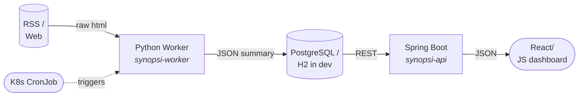

# Personalized News & Learning Summarizer
> *Turn noisy feeds into concise, relevant briefings—automatically.*

---

## What it does
1. **Ingests** articles from any RSS feed or static site.  
2. **Summarizes** them with a tiny, fine-tuned NLP model.  
3. **Surfaces** the TL;DR on a clean, responsive dashboard tailored to **your** interests.

---

## High-level Architecture


---

## Tech Stack
| Layer | Tech | Responsibility |
|-------|------|----------------|
| **Dashboard & API** | Spring Boot 3 + Kotlin (or Java 21) | Serve UI & REST endpoints |
| **Storage** | PostgreSQL (`postgres` profile, Flyway migrations) / H2 in-memory (default profile, tests) | Articles, users, preferences |
| **NLP Engine** | Python 3.11 | Scraping, cleaning, summarizing |
| **ML Framework** | PyTorch 2.x + `transformers` (DistilBART-cnn-6L) | Lightweight summarization |
| **Container** | Docker | 3 images (`synopsi-api`, `synopsi-ingestion`, `synopsi-summarization`), built locally |
| **Orchestration** | Kubernetes (Docker Desktop or Minikube) | CronJob, Deployment, Service |
| **CI** | GitHub Actions | Java tests and jar build, Python worker tests; no image publishing |

---

## Running on PostgreSQL
The default profile runs on in-memory H2 and loses everything on restart, which is
fine for `./gradlew bootRun` and the test suite. For data that survives a restart,
run the API with the `postgres` profile. Flyway creates and upgrades the schema
from `synopsi-api/src/main/resources/db/migration`, and Hibernate only validates
the entities against it.

```bash
# Start the database (postgres:16-alpine, named volume postgres-data, port 5432)
docker compose up -d postgres

# Run the API against it from the host
SPRING_PROFILES_ACTIVE=postgres SPRING_DATASOURCE_PASSWORD=synopsi ./gradlew bootRun

# Or run everything in containers (the api service already uses the profile)
docker compose up -d
```

The profile reads `SPRING_DATASOURCE_URL` (default `jdbc:postgresql://localhost:5432/synopsi`),
`SPRING_DATASOURCE_USERNAME` (default `synopsi`) and `SPRING_DATASOURCE_PASSWORD`
(no default; without it startup fails with a Postgres authentication error).
docker-compose uses `POSTGRES_PASSWORD`
(default `synopsi`) for both the database and the API.

`PostgresSchemaMigrationTest` runs the migration on a Testcontainers PostgreSQL
and checks it against the entities. It needs a Docker daemon and skips without
one; CI fails if it was skipped.

---

## Quick Start (local k8s)
```bash
```


---


## Key Features

---
