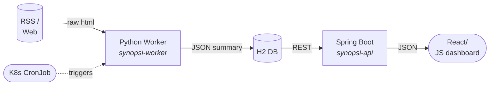

# Personalized News & Learning Summarizer  
> *Turn noisy feeds into concise, relevant briefings—automatically.*

---

## What it does
1. **Ingests** articles from any RSS feed or static site.  
2. **Summarizes** them with a tiny, fine-tuned NLP model.  
3. **Surfaces** the TL;DR on a clean, responsive dashboard tailored to **your** interests.

---

## High-level Architecture


---

## Tech Stack
| Layer | Tech | Responsibility |
|-------|------|----------------|
| **Dashboard & API** | Spring Boot 3 + Kotlin (or Java 21) | Serve UI & REST endpoints |
| **Storage** | H2 (dev) / PostgreSQL (prod) | Articles, users, preferences |
| **NLP Engine** | Python 3.11 | Scraping, cleaning, summarizing |
| **ML Framework** | PyTorch 2.x + `transformers` (DistilBART-cnn-6L) | Lightweight summarization |
| **Container** | Docker | 2 images (`synopsi-api`, `synopsi-worker`) |
| **Orchestration** | Kubernetes (Docker Desktop or Minikube) | CronJob, Deployment, Service |
| **CI/CD** | GitHub Actions | Test → Build → Push → (Optionally) Deploy |

---

## Quick Start (local k8s)
```bash
```


---


## Key Features
* **Zero-config personalization**  
  – Implicit feedback: click-through & dwell-time automatically re-ranks feeds.
* **Incremental summarization**  
  – Only new paragraphs are processed; cache keyed by content-hash.
* **Low-resource footprint**  
  – Model < 250 MB; quantized to 8-bit; runs on CPU in < 1 s/article.
* **Dark/Light mode** dashboard with **PWA** support—install on mobile like a native app.

---
